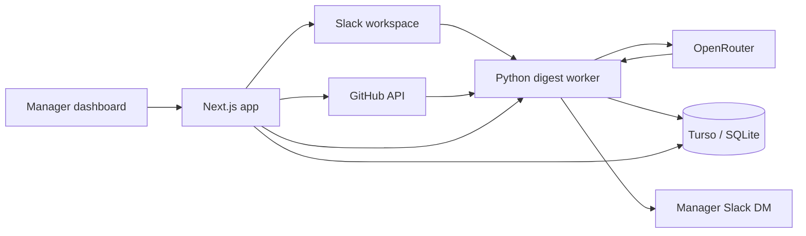

# Rundown

**Turn a week of Slack and GitHub activity into a one-minute manager briefing.**

[Live app](https://getrundown.vercel.app) · [Privacy policy](https://getrundown.vercel.app/privacy)

Rundown is an AI-powered team intelligence product that finds the signal buried in day-to-day collaboration. It reads selected Slack channels, connects related GitHub activity, extracts structured project updates, and delivers both a concise Slack DM and a searchable management dashboard.

## What it does

- **Structured team digests** — identifies action items, blockers, decisions, contributions, and a concise period summary from Slack conversations.
- **Manager delivery** — sends a formatted digest directly to a designated manager in Slack.
- **Operational dashboard** — tracks open actions, active blockers, decisions, contribution trends, channel activity, and historical digests.
- **GitHub context** — surfaces recent pull requests, review state, CI status, staleness, and change volume alongside Slack activity.
- **Workspace onboarding** — supports Slack OAuth, channel selection, recipient selection, scheduling, and optional GitHub configuration.
- **Multi-workspace scheduling** — stores workspace-specific configuration and runs daily, weekly, biweekly, or monthly digests.

## How it works



1. A workspace connects through Slack OAuth and selects the channels Rundown should monitor.
2. The Python worker fetches channel history and threads, resolving Slack identities to stable user records.
3. An OpenRouter model returns a schema-constrained digest instead of free-form prose.
4. Rundown deduplicates and stores the structured results in Turso, with SQLite available for local development.
5. The manager receives a Slack summary and can explore the underlying signals in the web dashboard.

Raw message content is used to generate the digest but is not stored after processing.

## Tech stack

| Layer | Technology |
| --- | --- |
| Dashboard | Next.js 16, React 19, TypeScript, Recharts, Framer Motion |
| Agent service | Python, Flask, Slack SDK, OpenAI-compatible client |
| AI | OpenRouter with structured tool calls |
| Integrations | Slack OAuth/Web API, GitHub REST API |
| Data | Turso/libSQL with local SQLite fallback |
| Deployment | Vercel and Railway |

## Repository map

```text
dashboard/        Next.js dashboard, OAuth flow, and web API routes
main.py           Digest orchestration and local scheduler
server.py         Flask trigger, status, health, and cron endpoints
fetcher.py        Slack channel and thread ingestion
analyzer.py       Structured LLM extraction
reporter.py       Slack Block Kit digest rendering and delivery
storage.py        Python persistence and schema migrations
identity.py       Slack identity normalization
```

## Run locally

### Prerequisites

- Python 3.11+
- Node.js 20
- A Slack app with the scopes listed below
- An OpenRouter API key
- Optional Turso and GitHub credentials

### 1. Configure the project

```bash
cp .env.example .env
```

Fill in the values needed for your development mode. The dashboard loads the root `.env` automatically.

### 2. Start the Python service

```bash
python -m venv .venv
source .venv/bin/activate
pip install -r requirements.txt
python server.py
```

The service starts on [http://localhost:8080](http://localhost:8080). Its health endpoint is `/health`.

### 3. Start the dashboard

```bash
cd dashboard
npm ci
npm run dev
```

Open [http://localhost:3000](http://localhost:3000). For Slack OAuth, add `http://localhost:3000/api/auth/callback` as a redirect URL in your Slack app.

## Run the agent directly

```bash
# Generate one digest from environment-based configuration
python main.py

# Generate a digest for a stored workspace
python main.py --workspace T01234567

# Run the local weekday scheduler
python main.py --schedule daily
```

## Configuration

| Variable | Purpose |
| --- | --- |
| `OPENROUTER_API_KEY` | Model access for structured digest generation |
| `SLACK_CLIENT_ID` / `SLACK_CLIENT_SECRET` | Slack OAuth credentials |
| `SLACK_BOT_TOKEN` | Local single-workspace Slack token |
| `SLACK_CHANNELS` | Comma-separated channel names for local agent runs |
| `MANAGER_SLACK_ID` | Slack user who receives local agent digests |
| `BACKFILL_DAYS` | Number of days to include in a digest |
| `TURSO_URL` / `TURSO_TOKEN` | Shared libSQL database connection |
| `SESSION_SECRET` | Signs dashboard session cookies |
| `AGENT_URL` | Dashboard-to-worker service URL |
| `RUN_SECRET` | Shared secret for worker trigger endpoints |
| `GITHUB_TOKEN` / `GITHUB_REPOS` | Optional GitHub signal integration |
| `NEXT_PUBLIC_BASE_URL` | Public dashboard URL used for OAuth callbacks |

See [.env.example](.env.example) for the complete template.

## Slack scopes

Rundown requests only the bot scopes required for its core workflows:

```text
channels:history  channels:read  channels:join
groups:history    groups:read
im:write          chat:write     users:read
```

The included `slack_app_manifest.yml` can be imported when creating a Slack app.

## Quality checks

```bash
python -m compileall -q .

cd dashboard
npm run typecheck
npm run build
npm audit
```

## Deployment

- The dashboard is configured for Vercel from `dashboard/`.
- The Flask agent service is configured for Railway with `railway.toml`.
- Set the same `TURSO_URL`, `TURSO_TOKEN`, and `RUN_SECRET` in both deployments.

## Privacy

Rundown stores structured digest results and workspace configuration, not raw Slack message history. See the in-product [privacy policy](https://getrundown.vercel.app/privacy) for details.
